# AWS 구축 기록

> Reverdi — 중고 명품 통합 탐색 플랫폼
> 로컬(Vagrant + k3s)에서 검증한 구성을 AWS EKS 로 이관한 기록입니다.
>
> **2026-09-06 · 서울 리전(ap-northeast-2)**

---

## 1. 구축 방식

로컬과 **같은 방식**을 씁니다. git 에 있는 YAML 을 선언하고, 명령 한 줄로 실행합니다.

| 로컬 | AWS |
|---|---|
| `Vagrantfile` | `aws/cluster.yaml` |
| `infra/postgres-cluster.yaml` | `aws/rds.yaml` |
| `vagrant/scripts/` | `aws/scripts/` |
| `charts/reverdi/` | **그대로 재사용** |

`kubectl` 과 Helm 은 클러스터 안만 다룹니다. VPC 나 EKS 클러스터 자체는
만들 수 없어서 `eksctl` 과 CloudFormation 을 씁니다. **둘 다 YAML** 이라
"git 의 YAML 로 만든다"는 방식이 이어집니다.

### 완성된 구조

```
                            인터넷
                              │
        ┌─────────────────────┼─────────────────────┐
        │                     ▼                     │
        │      ┌──────────────────────────┐         │
        │      │   ALB  (퍼블릭 서브넷)     │         │
        │      └──────────────┬───────────┘         │
        │                     │                     │
        │  ┌──────────────────┼──────────────────┐  │
        │  │        EKS 클러스터 (사설 서브넷)      │  │
        │  │                  │                  │  │
        │  │   ┌──────────────┼──────────────┐   │  │
        │  │   │   AZ-b       │   AZ-c    AZ-d│   │  │
        │  │   │  ┌───────┐ ┌─┴─────┐ ┌──────┐│   │  │
        │  │   │  │ web 1 │ │ web 2 │ │ web 3││   │  │
        │  │   │  └───────┘ └───────┘ └──────┘│   │  │
        │  │   │  ┌───────┐ ┌───────┐         │   │  │
        │  │   │  │batch 1│ │batch 2│         │   │  │
        │  │   │  └───────┘ └───────┘         │   │  │
        │  │   │            ┌───────┐         │   │  │
        │  │   │            │ infra │         │   │  │
        │  │   │            └───────┘         │   │  │
        │  │   └─────────────────────────────-┘   │  │
        │  └──────────────────┬──────────────────┘  │
        │                     │                     │
        │      ┌──────────────┴───────────┐         │
        │      │   RDS (사설 서브넷)        │         │
        │      │   주 ──동기── 스탠바이     │         │
        │      │    └──비동기── 읽기복제본  │         │
        │      └──────────────────────────┘         │
        │                  VPC 10.0.0.0/16          │
        └───────────────────────────────────────────┘

        ECR          S3            (VPC 밖 · AWS 관리)
        이미지        업로드 파일
```

| 노드 | 역할 | 뜨는 것 |
|---|---|---|
| **web** ×3 | 서비스 | 웹 파드 (AZ 당 하나) |
| **batch** ×2 | 배치 | 크롤러 CronJob · Jenkins 빌드 |
| **infra** ×1 | 인프라 | Argo CD · Prometheus · Grafana · Jenkins |

---

## 2. 사전 준비

### 도구

```bash
# AWS CLI
curl "https://awscli.amazonaws.com/awscli-exe-linux-x86_64.zip" -o /tmp/awscliv2.zip
cd /tmp && unzip -q awscliv2.zip && sudo ./aws/install

# eksctl
curl -sL "https://github.com/eksctl-io/eksctl/releases/latest/download/eksctl_Linux_amd64.tar.gz" \
  | tar xz -C /tmp && sudo mv /tmp/eksctl /usr/local/bin/

# kubectl · helm
curl -LO "https://dl.k8s.io/release/$(curl -Ls https://dl.k8s.io/release/stable.txt)/bin/linux/amd64/kubectl"
sudo install kubectl /usr/local/bin/
curl -fsSL https://raw.githubusercontent.com/helm/helm/main/scripts/get-helm-3 | bash
```

### 자격증명

IAM 사용자를 만들고 액세스 키를 발급받습니다.

```bash
aws configure
#   Default region name: ap-northeast-2
#   Default output format: json

aws sts get-caller-identity
```

### 사전 점검

```bash
bash aws/scripts/00-preflight.sh
```

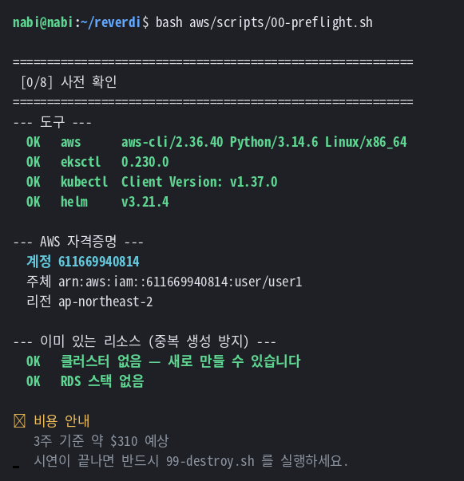

도구·자격증명·기존 리소스·서비스 할당량을 한 번에 확인합니다.
여기서 걸러야 15분 뒤에 권한 문제로 실패하는 것을 막습니다.

---

## 3. 클러스터

```bash
bash aws/scripts/10-cluster.sh
```

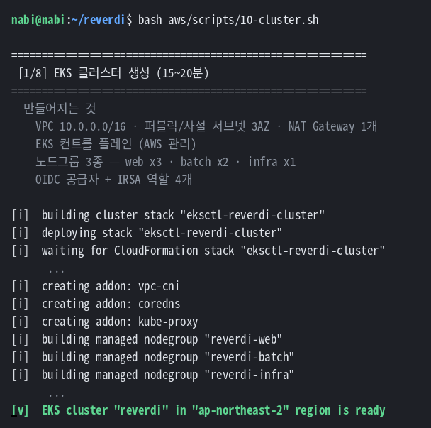

`aws/cluster.yaml` 한 파일로 다음이 만들어집니다. **15~20분** 걸립니다.

### VPC

```yaml
vpc:
  cidr: "10.0.0.0/16"
  nat:
    gateway: Single
```

퍼블릭·사설 서브넷이 3개 AZ 에 생기고, NAT Gateway 는 **1개**만 둡니다.

> AZ 당 하나씩 두면 3주에 $90 이 더 듭니다.
> NAT 이 죽으면 파드의 아웃바운드가 끊기지만 들어오는 트래픽은 영향이 없어,
> 시연 환경에서는 Single 이 맞는 선택입니다.

### 노드그룹

로컬의 node1~5 와 같은 역할 분담입니다.

| 노드그룹 | 타입 | 대수 | 라벨 | taint | 디스크 |
|---|---|:--:|---|---|---|
| `reverdi-web` | t3.medium | 3 | `workload=web` | 없음 | 30GB |
| `reverdi-batch` | t3.medium | 2 | `workload=batch` | NoSchedule | 60GB |
| `reverdi-infra` | t3.medium | 1 | `workload=infra` | NoSchedule | 50GB |

**AZ 를 지정하지 않습니다.** 관리형 노드그룹의 ASG 가 사설 서브넷 전체에
알아서 분산합니다. 웹 3대를 요청했으므로 **AZ 당 하나씩** 뜹니다.

> 로컬에서는 컨트롤 플레인(node0)에 taint 를 걸어 격리했는데,
> EKS 는 컨트롤 플레인이 AWS 관리 영역이라 그럴 필요가 없습니다.

**배치 노드가 2대인 이유** — 크롤러 CronJob 과 Jenkins 빌드 파드가
서로 밀어내지 않게 하기 위해서입니다. 빌드 파드는 컨테이너 5개를 띄워
노드 하나를 거의 다 씁니다.

### IRSA

```yaml
iam:
  withOIDC: true
  serviceAccounts:
    - metadata: { name: aws-load-balancer-controller, namespace: kube-system }
    - metadata: { name: ebs-csi-controller-sa,        namespace: kube-system }
    - metadata: { name: reverdi-web,                  namespace: reverdi }
    - metadata: { name: reverdi-batch,                namespace: reverdi }
```

**파드마다 다른 IAM 역할**을 줍니다. 로컬에는 없던 개념입니다.

| ServiceAccount | 권한 |
|---|---|
| `reverdi-web` | S3 읽기 · 쓰기 · 삭제 |
| `reverdi-batch` | **S3 쓰기만** |

크롤러가 뚫려도 파일을 지울 수는 없습니다.

앱 코드도 이 구조를 전제로 합니다.

```python
# app/domain/storage.py
# 컨테이너의 IAM 역할(ECS Task Role / EKS IRSA)로 인증하므로
# 액세스 키를 환경변수로 넣지 않는다
```

### 확인

```bash
kubectl get nodes -L workload,topology.kubernetes.io/zone
```

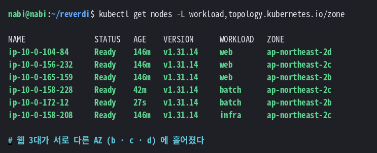

**웹 3대가 서로 다른 AZ** 에 흩어졌습니다.

---

## 4. 애드온

```bash
bash aws/scripts/20-addons.sh
```

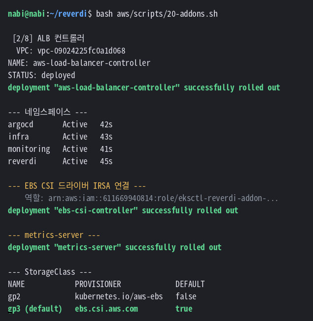

로컬 k3s 가 내장하던 기능들을 EKS 에서는 직접 설치합니다.

### ALB 컨트롤러

Ingress 를 만들면 실제 ALB 를 생성해주는 컨트롤러입니다.
**이게 없으면 Ingress 를 만들어도 아무 일도 일어나지 않습니다.**

```bash
helm upgrade --install aws-load-balancer-controller eks/aws-load-balancer-controller \
  -n kube-system \
  --set clusterName=reverdi \
  --set serviceAccount.create=false \
  --set serviceAccount.name=aws-load-balancer-controller
```

`serviceAccount.create=false` 가 중요합니다. `cluster.yaml` 의 IRSA 가
이미 만들었기 때문에, 여기서 또 만들면 IAM 역할 주석이 없는 SA 가 생깁니다.

### EBS CSI 드라이버

PVC 를 EBS 볼륨으로 연결합니다. 로컬 k3s 는 `local-path` 프로비저너가
내장이었는데 EKS 에는 없습니다.

**애드온과 IRSA 는 별개**라 역할을 따로 연결해야 합니다.
eksctl 이 만드는 역할 이름은 무작위라 스크립트가 조회해서 붙입니다.

```bash
EBS_ROLE=$(eksctl get iamserviceaccount --cluster reverdi --region ap-northeast-2 -o json \
  | python3 -c "...ebs-csi-controller-sa 의 roleARN 추출...")

eksctl create addon --cluster reverdi --name aws-ebs-csi-driver \
  --service-account-role-arn "$EBS_ROLE" --force
```

### gp3 StorageClass

기본으로 잡힌 gp2 를 gp3 로 바꿉니다. 같은 성능에 더 쌉니다.

```yaml
provisioner: ebs.csi.aws.com
volumeBindingMode: WaitForFirstConsumer
parameters:
  type: gp3
  encrypted: "true"
```

### metrics-server

HPA 가 CPU 를 읽으려면 필요합니다. 로컬 k3s 에는 내장이었습니다.

```bash
kubectl apply -f https://github.com/kubernetes-sigs/metrics-server/releases/latest/download/components.yaml
```

### 네임스페이스

```
reverdi · infra · argocd · monitoring
```

---

## 5. 이미지

```bash
bash aws/scripts/30-ecr.sh
```

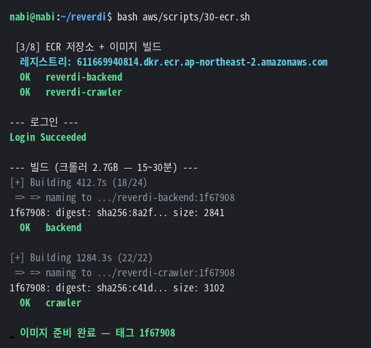

**20~35분** 걸립니다. 크롤러가 Chromium 을 포함해 2.7GB 입니다.

### ECR 저장소

```bash
aws ecr create-repository --repository-name reverdi-backend --image-scanning-configuration scanOnPush=true
aws ecr create-repository --repository-name reverdi-crawler --image-scanning-configuration scanOnPush=true
```

**수명주기 정책**도 겁니다. 없으면 이미지가 쌓여 요금이 계속 늡니다.

```json
{"rules":[{"rulePriority":1,"selection":{"countType":"imageCountMoreThan","countNumber":10},"action":{"type":"expire"}}]}
```

### 빌드

로컬 PC 에서 빌드해 push 합니다.

> 노드에서 빌드하려면 Jenkins 가 필요한데, Jenkins 를 올리려면
> 클러스터가 동작해야 하고, 클러스터가 동작하려면 이미지가 있어야 합니다.
> **첫 이미지는 손으로 올리는 게 맞습니다.**

```bash
aws ecr get-login-password --region ap-northeast-2 \
  | docker login --username AWS --password-stdin $ECR

docker build --platform linux/amd64 -f dockerfile.backend -t $ECR/reverdi-backend:$TAG .
docker push $ECR/reverdi-backend:$TAG
```

`--platform linux/amd64` 는 arm64 맥에서 필수입니다.
노드가 x86_64 라 arm64 이미지는 `exec format error` 로 죽습니다.

> 로컬에서는 사설 레지스트리가 HTTP 라 전 노드에 `registries.yaml` 을
> 배포해야 했는데, **ECR 은 HTTPS 라 그게 필요 없습니다.**
> 인증은 노드의 IAM 역할이 자동으로 처리합니다.

---

## 6. 데이터베이스

```bash
bash aws/scripts/40-rds.sh
```

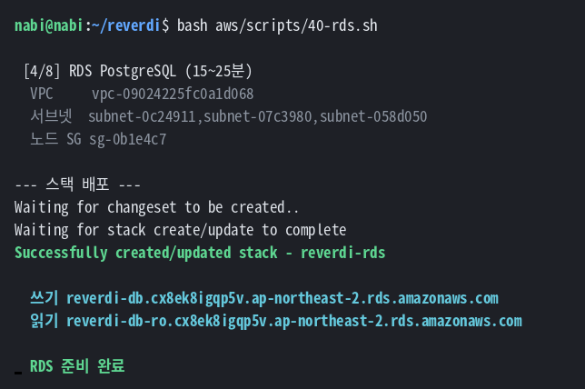

```bash
aws rds describe-db-instances --region ap-northeast-2 \
  --query 'DBInstances[].[DBInstanceIdentifier,DBInstanceStatus,EngineVersion,MultiAZ,AvailabilityZone]' \
  --output table
```

`aws/rds.yaml` (CloudFormation)로 만듭니다. **15~25분** 걸립니다.

### 구성

| | |
|---|---|
| 엔진 | PostgreSQL **17** (메이저만 지정) |
| 인스턴스 | `db.t4g.small` |
| **Multi-AZ** | ✅ 동기 스탠바이 |
| **읽기 복제본** | ✅ `db.t4g.small` |
| 스토리지 | 20GB gp3 · 암호화 |
| 백업 | 7일 · PITR |
| 퍼블릭 액세스 | ❌ 차단 |

> **마이너 버전을 박지 않습니다.** RDS 의 지원 버전 목록은 AWS 가 계속
> 바꿉니다. 메이저만 주면 그 시점의 최신 마이너를 골라줍니다.

### 상태 확인

```bash
aws rds describe-db-instances --region ap-northeast-2 \
  --query 'DBInstances[].[DBInstanceIdentifier,DBInstanceStatus,EngineVersion,MultiAZ,AvailabilityZone]' \
  --output table
```

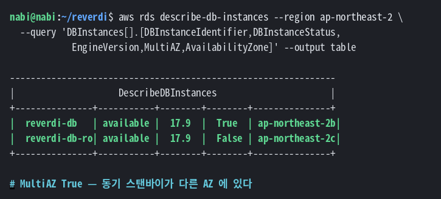

### 로컬과의 대응

| 로컬 (CloudNativePG) | AWS (RDS) |
|---|---|
| `reverdi-db-rw` | WriterEndpoint |
| `reverdi-db-ro` | ReaderEndpoint |
| 자동 승격 | Multi-AZ 자동 페일오버 |
| primary 1 + replica 2 | 주 + 스탠바이 + 읽기 복제본 |

**스탠바이는 읽기에 못 씁니다.** 고가용성 전용입니다.
조회 오프로딩은 별도의 읽기 복제본이 담당합니다.

### 암호화 연결 강제

```yaml
DBParameterGroup:
  Parameters:
    rds.force_ssl: "1"
```

| 설정 | 하는 일 |
|---|---|
| `DATABASE_SSL_MODE=require` (앱) | 클라이언트가 TLS 를 요구 |
| **`rds.force_ssl=1`** (RDS) | **서버가 평문을 거부** |

**둘 다 있어야** 완성입니다. 앱 설정만 있으면 서버가 평문을 받아주는 한
실수로 평문이 될 수 있습니다.

### 보안그룹

```yaml
SecurityGroupIngress:
  - IpProtocol: tcp
    FromPort: 5432
    SourceSecurityGroupId: !Ref NodeSecurityGroupId
```

**소스를 노드 보안그룹으로 지정**하면 IP 가 바뀌어도 규칙을 안 고쳐도 됩니다.

---

## 7. 비밀값

```bash
bash aws/scripts/50-secrets.sh
```

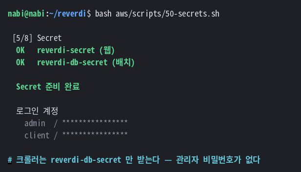

### 워크로드별로 나눕니다

| Secret | 받는 워크로드 | 내용 |
|---|---|---|
| `reverdi-secret` | 웹 | 계정 · SESSION_SECRET · DB |
| `reverdi-db-secret` | 크롤러 · 집계 · 백업 · 마이그레이션 | **DB 접속만** |

크롤러가 뚫려도 관리자 비밀번호는 넘어가지 않습니다.

**근거를 코드에서 확인했습니다.**

```bash
$ grep -rn "from app.auth" app/crawler/   # 결과 없음
$ grep -rn "from app.auth" alembic/       # 결과 없음
```

크롤러도 마이그레이션도 인증 모듈을 임포트하지 않습니다.
백엔드가 `require_secrets()` 를 그 값을 실제로 쓰는 모듈로 옮겨둔 덕분입니다.

### 순서가 반대입니다

| | 로컬 | AWS |
|---|---|---|
| 비밀번호 | CloudNativePG 가 만듦 → 꺼내 씀 | **우리가 만듦** → RDS 에 넣음 |

---

## 8. 앱 배포

```bash
bash aws/scripts/55-fill-values.sh    # <> 자리 채우기
bash aws/scripts/60-app.sh
```

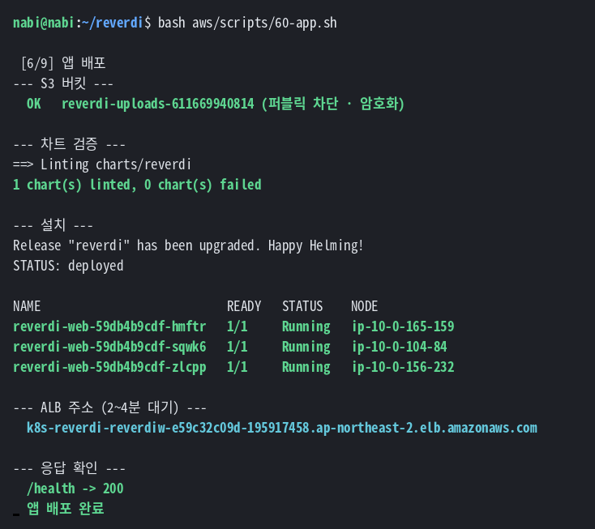

### 차트는 그대로입니다

```bash
helm upgrade --install reverdi charts/reverdi -n reverdi \
  -f charts/reverdi/values-aws.yaml \
  --set secretScope.perWorkload=true
```

**`templates/` 12개는 한 줄도 안 바뀝니다.** 값 파일만 다릅니다.

| | 로컬 | AWS |
|---|---|---|
| 값 파일 | `values-vagrant.yaml` | `values-aws.yaml` |
| 이미지 | 사설 레지스트리 | ECR |
| 외부 노출 | NodePort 30080 | **ALB** |
| 파일 저장 | MinIO | **S3** |
| SSL | `prefer` | **`require`** |
| IRSA | (없음) | `reverdi-web` · `reverdi-batch` |

### S3 버킷

```bash
aws s3api create-bucket --bucket reverdi-uploads-<계정>

# 퍼블릭 액세스 전면 차단
aws s3api put-public-access-block --bucket ... \
  --public-access-block-configuration \
  "BlockPublicAcls=true,IgnorePublicAcls=true,BlockPublicPolicy=true,RestrictPublicBuckets=true"

# 기본 암호화
aws s3api put-bucket-encryption --bucket ... --server-side-encryption-configuration ...
```

### Ingress → ALB

```yaml
ingress:
  className: alb
  annotations:
    alb.ingress.kubernetes.io/scheme: internet-facing
    alb.ingress.kubernetes.io/target-type: ip
    alb.ingress.kubernetes.io/healthcheck-path: /health
    alb.ingress.kubernetes.io/listen-ports: '[{"HTTP": 80}]'
```

**헬스체크는 `/health`** 입니다. `/ready` 는 DB 를 확인하므로,
DB 장애 시 파드 3개가 동시에 대상그룹에서 빠집니다.

> 도메인이 정해지면 ACM 인증서를 만들고 `certificateArn` ·
> `listen-ports` · `ssl-redirect` 세 가지를 같이 바꾸면 HTTPS 가 됩니다.

### 확인

```bash
curl -s http://<ALB주소>/ready | python3 -m json.tool
```

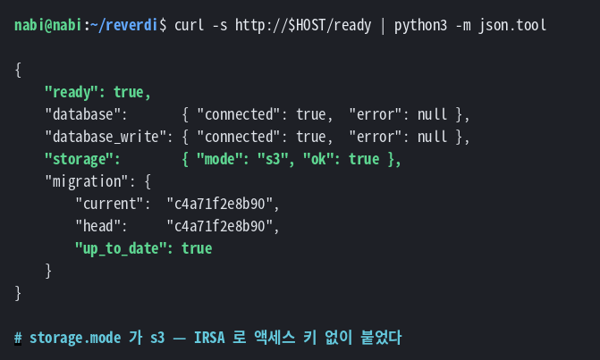

**`storage.mode` 가 `s3`** 라는 건 IRSA 가 동작한다는 뜻입니다.

```bash
kubectl get pod -n reverdi -o wide
```

```
NAME                           READY   STATUS    NODE                AZ
reverdi-web-59db4b9cdf-hmftr   1/1     Running   ip-10-0-165-159     2b
reverdi-web-59db4b9cdf-sqwk6   1/1     Running   ip-10-0-104-84      2d
reverdi-web-59db4b9cdf-zlcpp   1/1     Running   ip-10-0-156-232     2c
reverdi-crawler-29811360-...   0/1     Complete  ip-10-0-172-12      2b
```

웹 파드 3개가 **노드마다 하나씩** — `topologySpreadConstraints` 가 동작한 결과입니다.
로컬에서는 호스트명 기준이었는데 AWS 에서는 **AZ 기준**이 됩니다.

---

## 9. GitOps

```bash
bash aws/scripts/70-argocd.sh
```

### Application 등록

```yaml
apiVersion: argoproj.io/v1alpha1
kind: Application
metadata:
  name: reverdi
  namespace: argocd
spec:
  source:
    repoURL: https://github.com/jpnjb0918-glitch/reverdi.git
    targetRevision: main
    path: charts/reverdi
    helm:
      valueFiles: [values-aws.yaml]
      parameters:
        - name: secretScope.perWorkload
          value: "true"
  syncPolicy:
    automated: { prune: true, selfHeal: true }
```

**`--set` 대신 `parameters` 에 명시**합니다.
Argo CD 는 git 만 보므로 명령줄 인자는 안 보입니다.
**GitOps 에서는 파일에 있는 것이 정답**입니다.

### 인터넷에 노출하지 않습니다

```yaml
server:
  service:
    type: ClusterIP
```

Argo CD 는 클러스터를 바꿀 수 있는 도구라, 비밀번호 하나가 곧 클러스터 전체입니다.

```bash
kubectl port-forward -n argocd svc/argocd-server 8080:80
```

---

## 10. 모니터링

```bash
bash aws/scripts/80-monitoring.sh
```

기존 값 파일을 그대로 쓰고, 다른 부분만 오버레이로 덮습니다.

```bash
helm upgrade --install kps prometheus-community/kube-prometheus-stack -n monitoring \
  -f helm-values/kube-prometheus-stack.yaml \
  -f helm-values/aws/kube-prometheus-stack.yaml
```

### 오버레이가 바꾸는 것

```yaml
# helm-values/aws/kube-prometheus-stack.yaml
prometheus:
  prometheusSpec:
    retention: 3d                        # 로컬 7d — EBS 요금 절약
    storageSpec: { storageClassName: gp3 }   # local-path → gp3
grafana:
  persistence: { storageClassName: gp3 }
  service: { type: ClusterIP }             # NodePort → ClusterIP
```

**toleration · nodeSelector · 자원 요청은 로컬에서 쓰던 그대로** 유지됩니다.
Helm 은 `-f` 를 여러 번 받으면 뒤에 온 것이 이깁니다.

로컬에서 고친 `prometheus-node-exporter` 서브차트 키도 그대로 따라옵니다.

### 앱 지표

```yaml
kind: ServiceMonitor
spec:
  endpoints:
    - { port: http, path: /metrics, interval: 30s }
```

### 확인

```bash
kubectl get pod -n monitoring
```

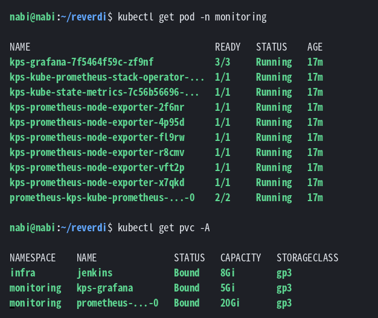

**node-exporter 가 노드 수만큼** 떠야 전 노드 지표가 걷힙니다.

```bash
kubectl get pvc -A
```

```
NAMESPACE    NAME               STATUS   CAPACITY   STORAGECLASS
infra        jenkins            Bound    8Gi        gp3
monitoring   kps-grafana        Bound    5Gi        gp3
monitoring   prometheus-...-0   Bound    20Gi       gp3
```

EBS 볼륨이 자동으로 만들어져 붙었습니다.

---

## 11. CI

```bash
bash aws/scripts/90-jenkins.sh
bash aws/scripts/95-jenkins-irsa.sh
```

### ECR push 권한

Jenkins 빌드 파드는 `infra` 네임스페이스에서 뜨므로,
`reverdi` 네임스페이스의 SA 를 쓸 수 없습니다. 별도로 만듭니다.

```bash
eksctl create iamserviceaccount \
  --cluster reverdi --namespace infra --name jenkins-ecr \
  --attach-policy-arn arn:aws:iam::aws:policy/AmazonEC2ContainerRegistryPowerUser \
  --approve
```

`PowerUser` 는 push·pull 은 되지만 **저장소 삭제는 안 됩니다.**

### 빌드 에이전트

Jenkinsfile 에 파드 정의가 인라인으로 들어 있습니다.

```yaml
spec:
  serviceAccountName: jenkins-ecr    # ECR push 권한
  nodeSelector: { workload: batch }  # 배치 노드에서만
  containers:
    - python      # lint · test
    - postgres    # 사이드카 테스트 DB
    - buildah     # 이미지 빌드 (privileged)
    - tools       # helm · git
```

**빌드할 때만 파드가 뜨고 끝나면 사라집니다.**

### 파이프라인

```
① 준비        uv 설치 · IMAGE_TAG = git 커밋 7자리
② lint        ruff
③ test        사이드카 Postgres + alembic + pytest 376건
④ build       ECR 로그인 → Buildah → push
⑤ chart lint  helm template 으로 렌더링 검증
⑥ gitops      values-aws.yaml 의 tag 를 git 에 커밋
```

**ECR 인증은 IRSA 로** 합니다.

```bash
aws ecr get-login-password --region ap-northeast-2 \
  | buildah login --username AWS --password-stdin $REGISTRY
```

액세스 키가 없습니다. 파드가 IAM 역할로 토큰을 받습니다.

### 환경을 파라미터로

한 Jenkinsfile 로 로컬과 AWS 를 모두 씁니다.

| 파라미터 | AWS | 로컬 |
|---|---|---|
| `REGISTRY` | `<계정>.dkr.ecr...` | `192.168.56.15:30500` |
| `VALUES_FILE` | `values-aws.yaml` | `values-vagrant.yaml` |

---

## 12. 전체 흐름 확인

```
   개발자
     │ push
     ▼
 ┌─────────────┐
 │  CloudeDX   │  앱 소스
 └──────┬──────┘
        │ 감지
        ▼
 ┌──────────────────────────────┐
 │          Jenkins             │   빌드 에이전트는 파드로 뜬다
 │  ① lint    ruff              │   (batch 노드 · 끝나면 사라짐)
 │  ② test    pytest 376건      │
 │  ③ build   Buildah           │
 └────┬───────────────────┬─────┘
      │ 이미지             │ 태그 커밋
      ▼                   ▼
 ┌─────────┐        ┌─────────────┐
 │   ECR   │        │   reverdi   │  배포 저장소
 └────┬────┘        └──────┬──────┘
      │                    │ 감지 (3분 이내)
      │                    ▼
      │             ┌─────────────┐
      │             │   Argo CD   │  Synced / Healthy
      │             └──────┬──────┘
      │                    │ 동기화
      │  이미지 pull        ▼
      └──────────────►  EKS 파드
```

🔴 **Jenkins 에는 클러스터 권한이 없습니다.** git 에 커밋만 합니다.
배포는 Argo CD 가 하고, Jenkins 는 kubeconfig 도 EKS IAM 도 갖지 않습니다.

### 실행 결과

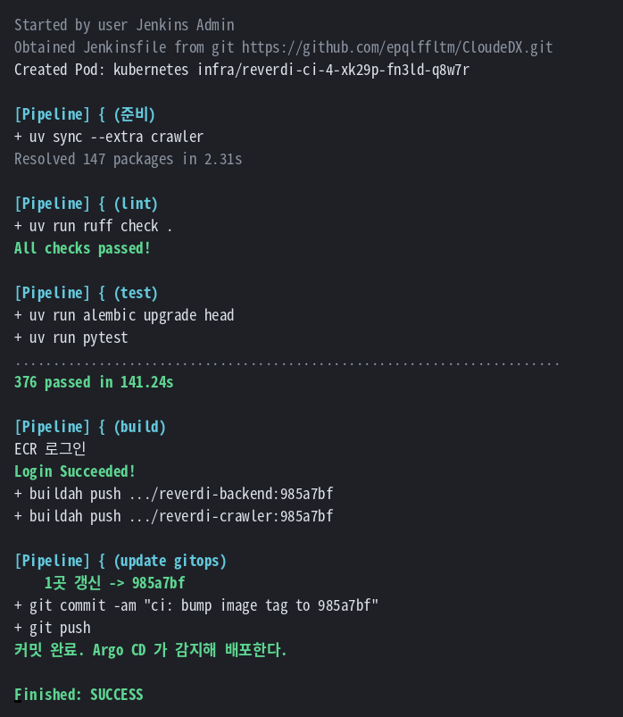

### git 이 바뀌었는지

```bash
git clone --depth 1 https://github.com/jpnjb0918-glitch/reverdi.git /tmp/ci
grep -n "tag:" /tmp/ci/charts/reverdi/values-aws.yaml
cd /tmp/ci && git log --oneline -2
```

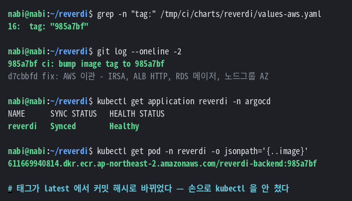

### Argo CD 가 반영했는지

```bash
kubectl get application reverdi -n argocd
kubectl get pod -n reverdi -l app.kubernetes.io/component=web \
  -o jsonpath='{.items[0].spec.containers[0].image}'
```

```
NAME      SYNC STATUS   HEALTH STATUS
reverdi   Synced        Healthy

611669940814.dkr.ecr.ap-northeast-2.amazonaws.com/reverdi-backend:985a7bf
```

**태그가 `latest` 에서 커밋 해시로 바뀌었습니다.**

**손으로 `kubectl` 을 치지 않았는데 배포됐습니다.**

### 저장소를 둘로 나눈 이유

| | |
|---|---|
| 앱 소스 | `CloudeDX` |
| 배포 설정 | `reverdi` |

같은 곳에 두면 Jenkins 가 커밋한 것이 다시 Jenkins 를 깨워 **무한 루프**가 납니다.

나눈 덕에 얻은 것:

- **Jenkins 에 클러스터 권한이 필요 없습니다** — kubeconfig 도, EKS IAM 도
- **git 커밋이 곧 배포 이력**입니다
- 손으로 바꿔도 Argo CD 가 되돌립니다 (`selfHeal`)
- 롤백은 `git revert`

---

## 13. 페일오버 시연

**창 1** — 조회를 1초마다

```bash
HOST=$(kubectl get ingress -n reverdi -o jsonpath='{.items[0].status.loadBalancer.ingress[0].hostname}')
while true; do
  printf '%s  ' "$(date +%H:%M:%S)"
  curl -s -o /dev/null -w "%{http_code}\n" -m 3 "http://$HOST/"
  sleep 1
done
```

**창 2** — 강제 페일오버

```bash
aws rds reboot-db-instance --db-instance-identifier reverdi-db \
  --force-failover --region ap-northeast-2
```

### 결과

**창 1** (조회)

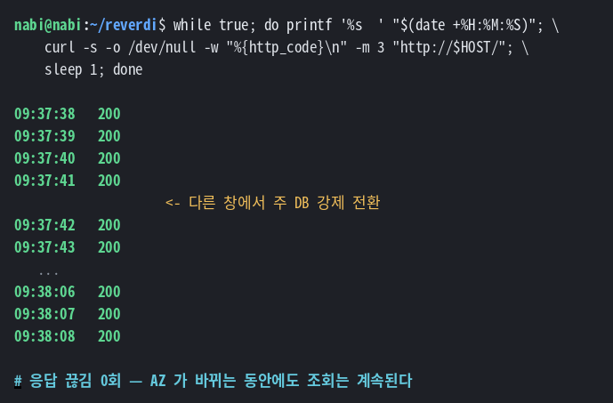

**창 2** (DB 상태)

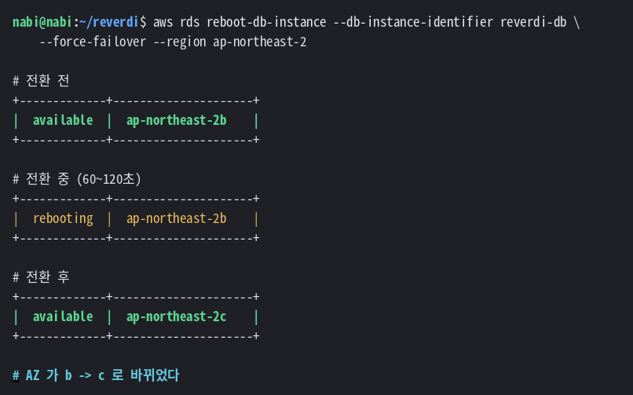

**응답이 한 번도 끊기지 않았습니다.** AZ 가 바뀌는 동안에도 조회는 계속됩니다.
읽기가 복제본으로 가기 때문입니다.

로컬 CloudNativePG 에서 확인한 것과 **같은 동작**입니다.

---

## 14. 접속

```bash
bash aws/scripts/99-summary.sh
```

```
███████████████████████████████████████████████████████████████
   AWS 배포 완료
███████████████████████████████████████████████████████████████

───────────────────────────────────────────────────────────
 접속
───────────────────────────────────────────────────────────

  웹 앱   http://k8s-reverdi-reverdiw-e59c32c09d-...elb.amazonaws.com
          admin  / ****************
          client / ****************

  🔴 Argo CD · Jenkins 는 ALB 를 안 만든다.
     포트포워딩으로 본다 — 인터넷에 노출하지 않는다.

  Argo CD   kubectl port-forward -n argocd svc/argocd-server 8080:80
  Grafana   http://k8s-monitori-kpsgrafa-1f9a62fcec-...elb.amazonaws.com
  Jenkins   kubectl port-forward -n infra svc/jenkins 8081:8080
```

| | |
|---|---|
| 웹 앱 | ALB 주소 (인터넷) |
| Grafana | NLB 주소 (팀 공유용) |
| Argo CD · Jenkins | 포트포워딩만 |

```bash
kubectl port-forward -n argocd svc/argocd-server 8080:80
kubectl port-forward -n infra svc/jenkins 8081:8080
```

**운영 도구는 인터넷에 노출하지 않습니다.**

### 비밀번호 확인

```bash
kubectl get secret reverdi-secret -n reverdi -o jsonpath='{.data.ADMIN_PASSWORD}' | base64 -d ; echo
kubectl -n argocd get secret argocd-initial-admin-secret -o jsonpath='{.data.password}' | base64 -d ; echo
kubectl get secret grafana-admin -n monitoring -o jsonpath='{.data.admin-password}' | base64 -d ; echo
```

설치할 때마다 새로 만들어집니다. 파일에 안 적어두고 필요할 때 꺼내 씁니다.

---

## 15. 비용

### 3주 기준

| 항목 | |
|---|---:|
| EKS 컨트롤 플레인 | $50 |
| EC2 (t3.medium ×6) | $110 |
| RDS Multi-AZ + 복제본 | $62 |
| NAT Gateway ×1 | $30 |
| ALB · NLB | $31 |
| EBS · S3 · ECR · IPv4 | $28 |
| **합계** | **약 $310** |

**하루 약 $15** 입니다.

### 줄이는 방법

시연하지 않는 날은 노드를 내립니다.

```bash
eksctl scale nodegroup --cluster reverdi --name reverdi-web --nodes 0 --region ap-northeast-2
```

EKS · NAT · RDS 는 계속 나가지만 EC2 비용이 빠져 하루 $8 정도가 됩니다.

### 예산 경보

```bash
aws budgets create-budget --account-id <계정> \
  --budget file://budget.json \
  --notifications-with-subscribers file://notify.json
```

80% · 100% 에서 이메일이 옵니다.

---

## 16. 정리

```bash
bash aws/scripts/99-destroy.sh
```

**순서가 중요합니다.**

```
① Helm 릴리스   ALB · EBS 볼륨이 여기서 지워진다
② RDS 스택
③ EKS 클러스터  VPC · NAT 포함
④ 남은 것       ECR · S3 · 로그
```

순서를 바꾸면 `eksctl` 이 VPC 를 못 지웁니다.
ALB 가 서브넷을 잡고 있는데 그건 쿠버네티스가 만든 거라
CloudFormation 이 모릅니다.

### 삭제 후 확인

```bash
aws ec2 describe-addresses --region ap-northeast-2                    # 탄력적 IP
aws elbv2 describe-load-balancers --region ap-northeast-2             # 로드밸런서
aws ec2 describe-volumes --region ap-northeast-2 \
  --filters Name=status,Values=available                               # 미사용 EBS
aws rds describe-db-instances --region ap-northeast-2                  # RDS
```

```
--- 남은 요금 리소스 확인 ---

  탄력적 IP (있으면 시간당 $0.005)
------------------------------
|      DescribeAddresses     |
+----------------------------+

  로드밸런서
------------------------------
|  DescribeLoadBalancers     |
+----------------------------+

  EBS 볼륨 (available 상태면 미사용인데 요금은 나갑니다)
------------------------------
|      DescribeVolumes       |
+----------------------------+

  ✅ 삭제 완료. 위 목록이 비어 있으면 요금이 멈춥니다.
```

**전부 비어 있어야** 요금이 멈춥니다.

> `available` 상태의 EBS 볼륨은 아무것도 안 하는데 요금은 나갑니다.
> PVC 를 지우기 전에 클러스터를 지우면 이렇게 남습니다.

---

## 부록 — 로컬과 AWS 대응표

### 그대로 쓰는 것

| | |
|---|---|
| `charts/reverdi/templates/` 12개 | **한 줄도 안 바뀜** |
| `helm-values/argocd.yaml` | + AWS 오버레이 |
| `helm-values/jenkins.yaml` | + AWS 오버레이 |
| `helm-values/kube-prometheus-stack.yaml` | + AWS 오버레이 |
| `Jenkinsfile` | 파라미터로 환경 전환 |

### 오버레이가 바꾸는 것

```yaml
NodePort   → ClusterIP     노드에 공인 IP 가 없다
local-path → gp3           k3s 내장 프로비저너는 EKS 에 없다
```

### 대체되는 것

| 로컬 | AWS |
|---|---|
| `infra/postgres-cluster.yaml` | RDS |
| `infra/registry.yaml` | ECR |
| `infra/registries.yaml` | 불필요 (ECR 은 HTTPS) |
| `infra/minio.yaml` | S3 |

**매니페스트는 버려지지만, 그것으로 검증한 앱 설정은 남습니다.**

### 로컬에 없던 개념

| | |
|---|---|
| **IRSA** | 파드마다 다른 IAM 역할 |
| **EBS CSI** | 볼륨 프로비저너 (k3s 는 내장) |
| **ALB 컨트롤러** | Ingress → ALB |
| **metrics-server** | HPA 용 지표 (k3s 는 내장) |
| **ECR 인증** | IAM 토큰 (로컬은 인증 없음) |
